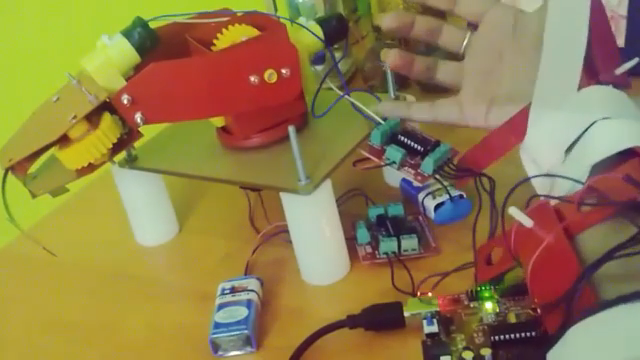

# Haptics
Haptics (pronounced HAP-tiks) is the science of applying touch (tactile) sensation and control to interaction with computer applications. The project is on creating an artificial arm prototype that mimics the human arm. We use pots at all the joints and as our hand moves the value of the Pot changes resulting in resistance variation which inturn affects the current. This is taken as an analog input on the microcontroller and we go-ahead with adjusting the motor shaft motions of the artificial arm depending upon the current values provided from the human arm. The project is a good experience is exercise your design and basic motion skills, However an improved version of this project was created which is wireless and more accurate and I shall upload it in my account soon.
 

